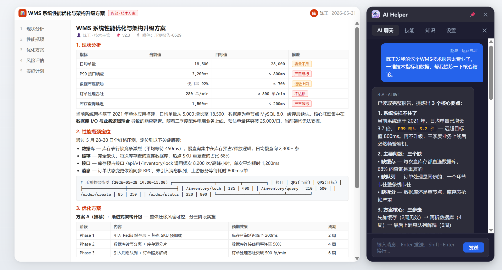
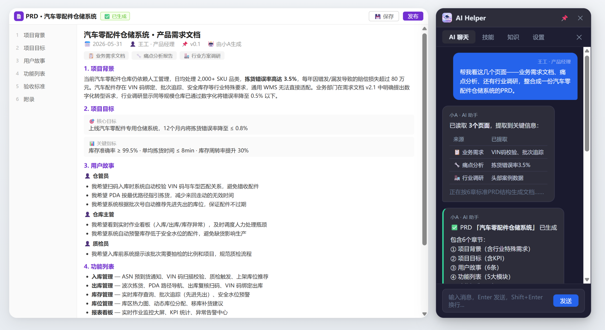
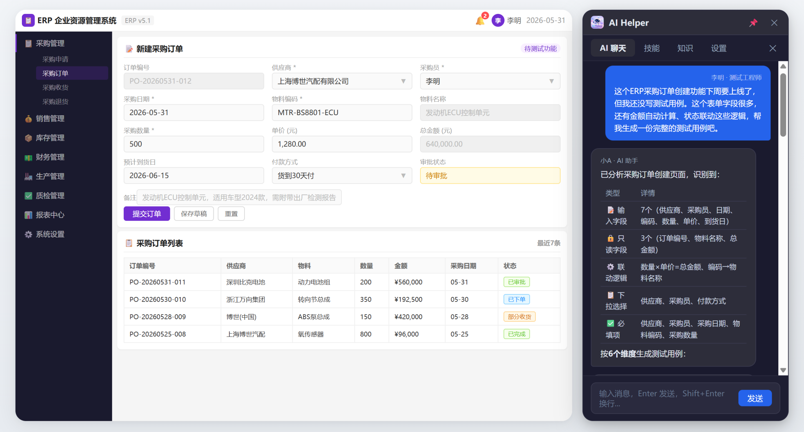
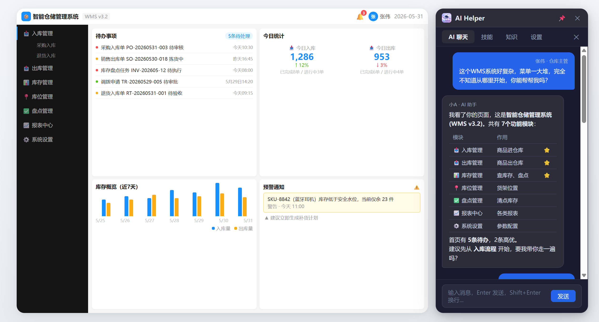
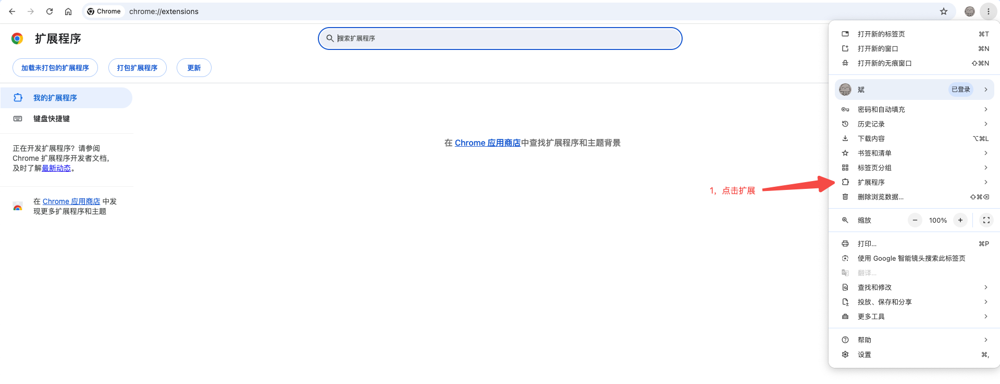
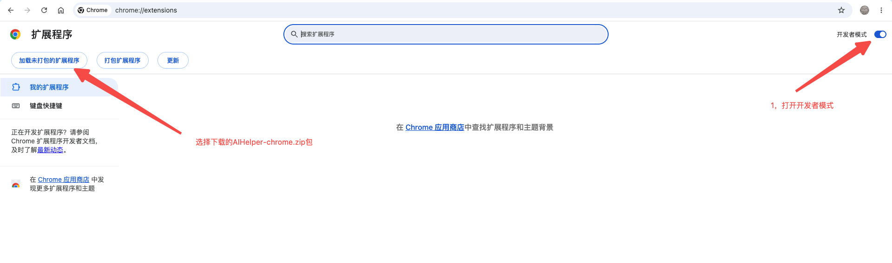
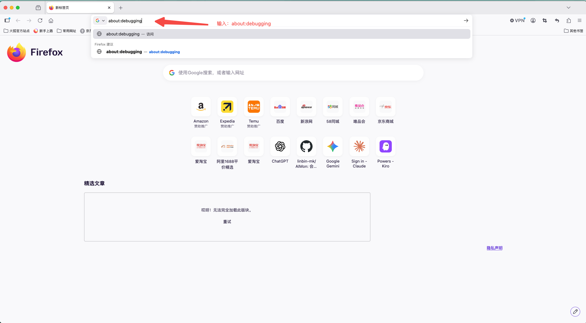
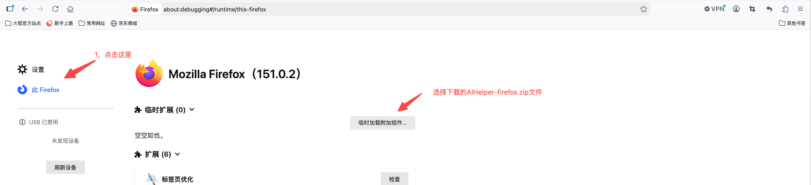

# AI Helper · 小A


<br>


你的浏览器 AI Agent「小A」

聊天就能让它帮你操作网页、分析数据、记住你的习惯。

## 适配平台

| 平台 | 状态 | 下载 | 安装教程 |
|------|------|------|------|
| Chrome | ✅ 已适配 | [下载](release/AIHelper-chrome.zip) | [教程](#chrome--edge--opera) |
| Firefox | ✅ 已适配 | [下载](release/AIHelper-firefox.zip) | [教程](#firefox) |
| Edge | ✅ 已适配 | [下载](release/AIHelper-chrome.zip) | [教程](#chrome--edge--opera) |
| Opera | ✅ 已适配 | [下载](release/AIHelper-chrome.zip) | [教程](#chrome--edge--opera) |
| 其他 Chromium 内核浏览器 | ✅ 已适配 | [下载](release/AIHelper-chrome.zip) | [教程](#chrome--edge--opera) |

## 例子

比如你可以对它说：

- **🎓「我是新入职员工，帮我熟悉一下公司的业务系统」** → 自动打开各业务系统页面，讲解功能模块和操作流程，零培训上手
- **🏗️「这个业务系统功能太多太复杂，我完全不会用」** → 自动识别页面功能，引导你一步步完成操作，再复杂的系统也能轻松上手
- **🐞「开发调试时页面报错了，帮我排查一下问题」** → 自动分析报错信息，定位问题根因，给出修复方案
- **🛒「帮我去京东和淘宝比个价，看这款护肤品哪里更划算」** → 自动打开多个商品页面，对比价格、优惠、口碑，告诉你该在哪下单
- **🗣️「帮我看看今天有什么热点新闻」** → 自动打开网页、搜索、翻页，全程不用动手
- **📝「帮我把今天浏览的这几个页面内容写个周报」** → 读取页面要点，一气呵成生成周报
- **📊「分析当前页面的所有接口请求，看看有没有异常」** → 自动抓包、扫描状态码，标出问题接口
- **📋「看这几个页面的需求文档，给我输出技术概要设计」** → 提取需求要点，输出架构与模块设计
- **💻「看这几个页面的技术概要设计，给我输出全部代码」** → 解析设计文档，自动生成完整代码
- **🐞「排查这次 CICD 流水线报错，看看哪里出了问题」** → 打开 CICD 网页直接分析日志，定位错误并给出修复建议
- **🛡️「帮我做一次系统巡检」** → 自动扫描多个系统页面，汇总状态并生成巡检报告
- **🧠「所有你要用浏览器干的事，告诉我就行」** → 填表单、抢票、比价、自动签到、批量下载、监控页面变化、翻译整站……只要浏览器能做的，小A都能替你干

### 效果演示

> 演示数据均为 AI 随机生成，仅供展示效果


<br>

<br>

<br>


## 适配模型

| 模型 | 输入 | 输出 | 作者感受 | ✨ 前往体验 |
|------|------|------|------|------|
| deepseek-v4-flash | [¥1 / 百万 tokens](https://api-docs.deepseek.com/zh-cn/quick_start/pricing/) | [¥2 / 百万 tokens](https://api-docs.deepseek.com/zh-cn/quick_start/pricing/) | 人民币10块钱半个月用不完 | [✨ 前往体验 →](https://platform.deepseek.com/) |
| deepseek-v4-pro | [¥3 / 百万 tokens](https://api-docs.deepseek.com/zh-cn/quick_start/pricing/) | [¥6 / 百万 tokens](https://api-docs.deepseek.com/zh-cn/quick_start/pricing/) | 相当于顶级oups4.7 | [✨ 前往体验 →](https://platform.deepseek.com/) |

## 核心能力

### AI 对话
- 接入 OpenAI 兼容 API，支持 SSE 流式响应（深度支持 DeepSeek）
- Agent Loop 多轮工具调用（可配置最大轮数），内置自动循环检测终止机制
- 多会话管理：会话列表侧边栏，支持搜索、重命名、JSON 日志导出
- AI 自动生成会话标题，会话按时间分组（今天 / 昨天 / 本周 / 更早）
- 首页欢迎页展示最近会话与推荐提示词快速入口
- AI 交互卡片：
  - **技能激活卡片** — AI 激活技能时展示技能名称、描述和规则摘要
  - **工具调用卡片** — 可折叠/展开的工具执行状态（执行中 / 已完成），支持分组聚合展示
  - **提问卡片** — AI 向用户提问，支持预设选项（单选/多选）和自由输入
  - **授权确认卡片** — 敏感操作前请求用户确认，显示风险等级
  - **数据表格卡片** — 以表格形式展示结构化数据，支持行点击选择
  - **文件下载卡片** — AI 生成的文件提供一键下载
  - **工作产物集合卡片** — 批量展示产物文件，支持按目录树预览和批量下载

### 技能系统
- 可扩展的技能框架，通过 `/` 斜杠命令唤起技能面板，支持实时关键词筛选
- 已注册 **11 个技能**，按分类组织：

| 分类 | 技能 |
|------|------|
| 🧪 Testing | 测试数据生成 |
| 📦 Product | 产品专家、需求转 PRD、网站大纲扫描 |
| 💻 Development | 代码大师、前端复制大师、OpenSpec Explore / Propose / Apply / Archive |
| 🎯 业务 | 推荐技能 |

- 技能收藏夹：创建/编辑/删除集合，添加/移除技能，一键切换组合技能
- AI 智能搜索：AI 根据上下文自动推荐最适合当前任务的技能

### 网络请求监控
- 实时捕获当前标签页所有 XHR/Fetch 请求，按 Tab 隔离，环形缓冲区保留 100 条
- 展开请求行查看完整请求头、请求体、响应体，支持 Tab 切换浏览
- 一键重放请求，快速验证接口

### 请求头管理
- 动态添加/删除自定义请求头（如 Authorization），通过 declarativeNetRequest 注入
- 按标签页隔离，互不干扰

### Cookie 监控
- 查询当前页面 Cookie 数量，区分 Session 与 Persistent 类型

### 知识管理
- 本地文件 / 文件夹导入，IndexedDB 持久化缓存
- 文件树预览 + 文件内容查看（代码高亮），支持删除操作
- 支持 21 种源码文件格式

### 记忆管理
- 对话结束后 AI 自动生成会话记忆，按域名持久化隔离
- 支持通用记忆域（跨域名记忆）
- `/memory` 命令查看历史记忆，AI 可通过工具自动检索匹配记忆

### 工作产物
- AI 对话中保存代码、文档、配置等文件到独立工作产物卡片
- 支持 OpenSpec 变更产物管理（proposal / design / specs / tasks）
- 批量下载产物文件，按目录树展示

### 高级配置
- 多语言支持：中文 / English / 跟随系统，覆盖全部 UI 文本
- 模型配置：API Base URL、API Key、模型名、Model Type、最大工具调用轮数
- AGENTS.md 系统提示词缓存，支持编辑 / 重置
- 深色 / 浅色双主题（Catppuccin 配色），持久化偏好
- 调试模式开关

## 架构

```
┌──────────────────────────────────────────────────────────────────┐
│                      shared/ (公共业务逻辑)                        │
│  chat.js / config.js / knowledge.js / memory.js                  │
│  session-manager.js / skill-registry.js / i18n.js                │
│  agents-md-cache.js / output-files.js / favorites-manager.js     │
│  resource.js / css/panel.css / lib/marked.min.js                 │
├───────────────────────┬──────────────────────────────────────────┤
│    chrome-extension/  │         firefox-extension/               │
│         Chrome        │            Firefox                       │
│   (含 Edge / Opera)   │                                         │
│         ┌─────────────┤                ┌─────────────┐           │
│         │Side Panel   │                │ Sidebar     │           │
│         │panel.html   │                │popup.html   │           │
│         │panel.js     │                │popup.js     │           │
│         └─────────────┤                └─────────────┘           │
│   chrome.runtime.sendMessage    chrome.runtime.sendMessage       │
│         ┌─────────────┤                ┌─────────────┐           │
│         │Service      │                │Event Page   │           │
│         │Worker       │                │background.js│           │
│         │background.js│                │(scripts[]   │           │
│         │(service     │                │ 加载)       │           │
│         │ worker 模式) │                │             │           │
│         └─────────────┤                └─────────────┘           │
│   headerManager.js     │         headerManager.js                │
│   (DNR 动态规则)       │         (webRequest 阻塞模式)           │
│   chrome.webRequest    │         chrome.webRequest               │
│   chrome.storage.local │         chrome.storage.local            │
│   chrome.cookies       │         chrome.cookies                  │
│   chrome.tabs          │         chrome.tabs                     │
│   chrome.scripting     │         chrome.scripting                │
├───────────────────────┴──────────────────────────────────────────┤
│             Content Scripts (页面注入 — 双平台共享)               │
│  sync.sh: chrome-extension/src/content/ → firefox-extension/     │
│  request-interceptor.js — fetch/XHR 拦截（MAIN world）            │
│  request-interceptor-bridge.js — 消息桥接（ISOLATED world）      │
│  page-context.js / page-interactive-elements.js                  │
│  page-css.js / page-source.js / page-js.js                       │
│  auth-extractor.js / element-click.js / execute-request-inject.js│
├──────────────────────────────────────────────────────────────────┤
│                 持久化存储                                        │
│  chrome.storage.local: 配置、会话、Header、记忆、收藏夹、输出文件 │
│  IndexedDB (ai_helper_code_cache): 知识库文件缓存 + 文件树       │
└──────────────────────────────────────────────────────────────────┘
```

## 目录结构

```
AIHelper/
├── shared/                    ← 公共业务逻辑（单一真相源）
│   ├── chat.js                # AI 对话、27 个工具定义、Agent Loop
│   ├── config.js              # 模型配置管理
│   ├── knowledge.js           # 知识库管理（IndexedDB）
│   ├── memory.js              # 记忆管理
│   ├── session-manager.js     # 多会话管理
│   ├── skill-registry.js      # 技能注册框架
│   ├── i18n.js                # 国际化（中/英文）
│   ├── agents-md-cache.js     # AGENTS.md 系统提示词缓存
│   ├── output-files.js        # 工作产物管理
│   ├── favorites-manager.js   # 技能收藏夹管理
│   ├── resource.js            # Git 同步 / 代码缓存
│   ├── css/panel.css          # UI 样式（Catppuccin 双主题）
│   └── lib/marked.min.js      # Markdown 渲染
│
├── skills/                    ← 技能定义（11 个，双平台共享）
│   ├── skills.json
│   ├── test-data-generation/
│   ├── code-master/
│   ├── frontend-copy-master/
│   ├── openspec-explore/ openspec-propose/ openspec-apply/ openspec-archive/
│   ├── product-expert/
│   ├── recommend-skill/
│   ├── requirement-to-prd/
│   └── website-outline/
│
├── chrome-extension/          ← Chrome 扩展 (含 Edge / Opera)
│   ├── manifest.json          # MV3 Service Worker + Side Panel
│   └── src/
│       ├── background.js      # Service Worker
│       ├── headerManager.js   # DNR 动态规则
│       ├── content/           # Content Scripts
│       ├── panel/             # Side Panel 入口
│       │   ├── panel.html
│       │   └── panel.js
│       └── shared/            ← sync.sh 生成
│
├── firefox-extension/         ← Firefox 扩展
│   ├── manifest.json          # MV3 Event Pages + sidebar_action
│   └── src/
│       ├── background.js      # Event Page + action.onClicked
│       ├── headerManager.js   # webRequest 阻塞模式
│       ├── content/           ← sync.sh 生成
│       ├── popup/             # Sidebar 入口
│       │   ├── popup.html
│       │   ├── popup.js
│       │   └── popup.css
│       └── shared/            ← sync.sh 生成
│
├── sync.sh                    ← 一键同步共享文件到两个扩展目录
└── AGENTS.md                  ← AI 协作规范
```

### 文件编辑规则

- **`shared/` 是公共代码的唯一真相源**。编辑业务逻辑时只改 `shared/`，不要改 `chrome-extension/src/shared/` 或 `firefox-extension/src/shared/`
- **编辑 `shared/`、`skills/`、`chrome-extension/src/content/` 后必须运行 `bash sync.sh`**
- **平台专属文件**直接编辑对应扩展目录，无需 sync：
  - Chrome：`chrome-extension/src/background.js` / `headerManager.js` / `panel/`
  - Firefox：`firefox-extension/src/background.js` / `headerManager.js` / `popup/`

### 平台差异对比

| 特性 | Chrome | Firefox |
|------|--------|---------|
| Manifest 版本 | MV3 | MV3 |
| 后台脚本 | Service Worker (`service_worker`) | Event Page (`scripts[]`) |
| UI 入口 | `sidePanel` (Side Panel) | `sidebar_action` (Sidebar) |
| 请求头管理 | `declarativeNetRequest` (DNR) | `webRequest.onBeforeSendHeaders` (阻塞模式) |
| 命名空间 | `chrome.*` | `chrome.*` + `browser.*` |

## 安装

### Chrome / Edge / Opera

1. 打开浏览器，访问扩展管理页：
   - Chrome：`chrome://extensions/`
   - Edge：`edge://extensions/`
2. 开启「开发者模式」
3. 点击「加载已解压的扩展程序」
4. 选择 `chrome-extension/` 目录
5. 点击工具栏图标打开侧边栏


<br>


### Firefox

1. 访问 `about:debugging#/runtime/this-firefox`
2. 点击「临时载入附加组件」
3. 选择 `firefox-extension/manifest.json`
4. 点击工具栏图标打开侧边栏


<br>


## 使用

### 模型配置

切换到「设置」Tab，填写 API 信息：

| 字段 | 示例 |
|------|------|
| API Base URL | `https://api.deepseek.com` |
| API Key | `sk-your-api-key-here` |
| 模型 | `deepseek-v4-pro` |

### AI 对话

1. 配置完成后切换到「AI 对话」Tab
2. 输入 `/` 可唤起技能面板，选择技能激活专注模式
3. 点击侧边栏图标展开会话列表，支持搜索、切换、重命名、导出
4. AI 可调用 27 个内置工具（页面操作、知识检索、记忆管理、文件保存等），自动多轮执行完成复杂任务

### 技能收藏夹

1. 切换到「技能」Tab，浏览/搜索已注册技能
2. 点击收藏按钮创建收藏夹，添加多个技能
3. 支持创建多个收藏夹，为不同场景准备不同技能组合
4. AI 可根据对话上下文自动推荐技能

### 工作产物

1. AI 对话中使用 `save_output_file` 工具保存文件到工作产物卡片
2. 切换到「工作产物」Tab 查看目录树和文件内容
3. 支持批量下载或按指定路径过滤查看

### 知识库

1. 切换到「知识库」Tab
2. 选择本地文件或文件夹导入，文件将被缓存到 IndexedDB
3. AI 对话时可自动检索匹配的知识文件作为上下文

### 记忆管理

1. AI 对话结束后自动生成记忆，按域名存储
2. 输入 `/memory` 查看当前域名下的历史记忆
3. 支持通用记忆域（cross-domain memory），跨项目共享经验

## 构建 / 打包

本项目不使用 webpack、转译器、压缩器等构建工具，所有源文件即为最终扩展文件。

```bash
# 1. 同步共享文件到两个扩展目录
bash sync.sh

# 2. 打包 Chrome 和 Firefox 产物
bash build.sh
# → release/AIHelper-chrome.zip
# → release/AIHelper-firefox.zip
```

**环境要求**：macOS / Linux，`bash` + `zip` 命令行工具即可。无 Node.js 依赖。

## 技术栈

- **Manifest V3** — Chrome + Firefox 双平台支持
- **纯 HTML/CSS/JS** — 无前端框架，无构建步骤
- **双平台架构** — `shared/` 公共逻辑 + `chrome-extension/` + `firefox-extension/`，`sync.sh` 一键同步
- **OpenAI 兼容 API** — SSE 流式响应，DeepSeek / OpenAI 均可
- **isomorphic-git** — 浏览器端 Git 操作
- **marked** — Markdown 渲染
- **IndexedDB** — 知识库文件持久化缓存
- **Catppuccin** — 深色/浅色双主题配色
- **Kilo / OpenSpec** — AI 驱动的开发工作流（提案 → 规格 → 设计 → 实现 → 归档）

## 注意事项

- AI 对话需自行配置 OpenAI 兼容的 API 端点及 API Key
- API Key 存储于 `chrome.storage.local`（明文），请勿在不可信环境中使用
- Service Worker 可能被浏览器终止 idle，重启后内存中请求缓冲区会丢失
- 发布 Chrome Web Store 需 `host_permissions: ["<all_urls>"]`，可能触发额外审核

## 致谢

本项目全程使用 DeepSeekAI 编码开发，感谢中国源神。
