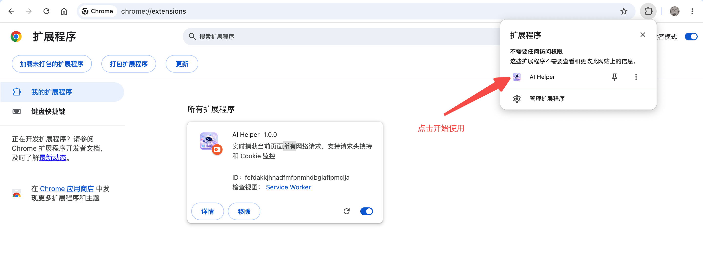

English | [中文](README.md)

# AI Helper — Open-Source All-in-One Browser Assistant


<br>

<h3>AI + Browser Extension — A New Paradigm for Browsing<br><br>
AI Summarize, AI Form Fill, AI Explain — chat to operate the browser, delivering a whole new experience.</h3>

## Supported Platforms

| Platform | Status | Download | Installation Guide | One-Click Install |
|----------|--------|----------|---------------------|-------------------|
| Chrome | ✅ Supported | [Download](release/AIHelper-chrome.zip) | [Installation Guide](#chrome--edge--opera) | [](https://chrome.google.com/webstore/detail/nkimedamccdojfikikbabldciidhcepf) |
| Firefox | ✅ Supported | [Download](release/AIHelper-firefox.zip) | [Installation Guide](#firefox) | [](https://addons.mozilla.org/firefox/addon/aihelper/) |
| Edge | ✅ Supported | [Download](release/AIHelper-chrome.zip) | [Installation Guide](#chrome--edge--opera) | - |
| Opera | ✅ Supported | [Download](release/AIHelper-chrome.zip) | [Installation Guide](#chrome--edge--opera) | - |
| Other Chromium Browsers | ✅ Supported | [Download](release/AIHelper-chrome.zip) | [Installation Guide](#chrome--edge--opera) | - |

## Examples

Here are some things you can say to it:

- **🎓 "I'm a new employee, help me get familiar with the company's business systems."** → Automatically opens various business system pages, explains features and workflows – zero training needed.
- **🏗️ "This business system is too complex, I don't know how to use it at all."** → Automatically identifies page features and guides you step by step through operations.
- **🐞 "There's an error on a page during development, help me troubleshoot it."** → Automatically analyzes error messages, locates root causes, and provides fix suggestions.
- **🛒 "Help me compare prices on JD.com and Taobao for this skincare product."** → Automatically opens multiple product pages, compares prices, discounts, and reviews, then tells you where to buy.
- **🗣️ "Show me today's trending news."** → Automatically opens web pages, searches, and paginates – no hands needed.
- **📝 "Write a weekly report based on the pages I browsed today."** → Reads page highlights and generates a weekly report in one go.
- **📊 "Analyze all API requests on the current page and check for anomalies."** → Automatically captures requests, scans status codes, and flags problematic endpoints.
- **📋 "Read the requirement docs on these pages and produce a technical design outline."** → Extracts key requirements and outputs architecture and module design.
- **💻 "Read the technical design on these pages and generate all the code."** → Parses design documents and automatically generates complete code.
- **🐞 "Diagnose this CICD pipeline failure and find out what went wrong."** → Opens the CICD page, directly analyzes logs, locates errors, and suggests fixes.
- **🛡️ "Run a system health check for me."** → Automatically scans multiple system pages, summarizes status, and generates a patrol report.
- **🧠 "Anything you need a browser for, just tell me."** → Filling forms, snatching tickets, price comparison, auto check-in, batch downloading, monitoring page changes, translating entire sites... whatever a browser can do, AI Helper can do for you.

### Demo

> All demo data is AI-generated and for demonstration purposes only.


<br>

<br>

<br>


## Supported Models

| Model | Input | Output | Our Impression | ✨ Try It |
|-------|-------|--------|----------------|-----------|
| deepseek-v4-flash | [¥1 / 1M tokens](https://api-docs.deepseek.com/zh-cn/quick_start/pricing/) | [¥2 / 1M tokens](https://api-docs.deepseek.com/zh-cn/quick_start/pricing/) | ¥10 lasts half a month | [✨ Try Now →](https://platform.deepseek.com/) |
| deepseek-v4-pro | [¥3 / 1M tokens](https://api-docs.deepseek.com/zh-cn/quick_start/pricing/) | [¥6 / 1M tokens](https://api-docs.deepseek.com/zh-cn/quick_start/pricing/) | Comparable to top-tier GPT-4.7 | [✨ Try Now →](https://platform.deepseek.com/) |

## Core Capabilities

### AI Chat
- Connects to OpenAI-compatible APIs, supports SSE streaming responses (deeply optimized for DeepSeek)
- Agent Loop with multi-turn tool calls (configurable max rounds), built-in auto loop detection and termination
- Multi-session management: session list sidebar with search, rename, and JSON log export
- AI auto-generates session titles; sessions grouped by time (Today / Yesterday / This Week / Older)
- Welcome page shows recent sessions and recommended prompt shortcuts
- AI Interaction Cards:
  - **Skill Activation Card** — Displays skill name, description, and rule summary when AI activates a skill
  - **Tool Call Card** — Collapsible/expandable tool execution status (running / completed), supports grouped aggregation
  - **Question Card** — AI asks the user a question, supports preset options (single/multi-select) and free text input
  - **Authorization Confirmation Card** — Requests user confirmation before sensitive operations, shows risk level
  - **Data Table Card** — Displays structured data in table format, supports row click selection
  - **File Download Card** — One-click download for AI-generated files
  - **Artifact Collection Card** — Batch display of artifact files, supports directory tree preview and batch download

### Skill System
- Extensible skill framework; trigger skill panel with `/` slash command, supports real-time keyword filtering
- **User Custom Skills**: Create your own skills — fill in name, description, category and prompt to activate in conversations
- **11 built-in skills**, organized by category:

| Category | Skills |
|----------|--------|
| 🧪 Testing | Test Data Generation |
| 📦 Product | Product Expert, Requirements to PRD, Website Outline Scanner |
| 💻 Development | Code Master, Frontend Copy Master, OpenSpec Explore / Propose / Apply / Archive |
| 🎯 Business | Skill Recommender |

- **Built-in & custom skills unified management**: built-in skills auto-merge on update; edited built-in skills preserved
- Skill Favorites: create/edit/delete collections, add/remove skills, one-click switch skill combos
- AI Smart Search: AI automatically recommends the best skill for the current task context

### Network Request Monitoring
- Real-time capture of all XHR/Fetch requests on the active tab, per-tab isolation, ring buffer holds 100 entries
- Expand request row to view full request headers, request body, response body, supports tabbed browsing
- One-click request replay for quick API verification

### Request Header Management
- Dynamically add/remove custom request headers (e.g., Authorization), injected via declarativeNetRequest
- Per-tab isolation, no cross-tab interference

### Cookie Monitoring
- Query current page cookie count, distinguishes between Session and Persistent cookies

### Knowledge Management
- Local file/folder import, IndexedDB persistent caching
- File tree preview + file content viewer (syntax highlighting), supports deletion
- Supports 21 source code file formats

### Memory Management
- AI automatically generates session memories after conversations, persisted per-domain
- Supports generic memory domain (cross-domain memory)
- `/memory` command to view historical memories; AI can auto-retrieve matching memories via tools

### Artifacts
- Save code, documents, config files from AI conversations into standalone artifact cards
- Supports OpenSpec change artifact management (proposal / design / specs / tasks)
- Batch download artifact files, displayed as a directory tree

### Advanced Configuration
- Multi-language support: Chinese / English / Follow System, covering all UI text
- Model Configuration: API Base URL, API Key, Model Name, Model Type, Max Tool Call Rounds
- AGENTS.md system prompt caching, supports editing / reset
- Dark / Light dual themes (Catppuccin color scheme), preference persisted
- Debug mode toggle

## Architecture

```
┌──────────────────────────────────────────────────────────────────┐
│                    shared/ (Shared Business Logic)                │
│  chat.js / config.js / knowledge.js / memory.js                  │
│  session-manager.js / skill-registry.js / skill-storage.js       │
│  skill-history.js / i18n.js / agents-md-cache.js                  │
│  resource.js / css/panel.css / lib/marked.min.js                 │
├───────────────────────┬──────────────────────────────────────────┤
│    chrome-extension/  │         firefox-extension/               │
│         Chrome        │            Firefox                       │
│  (incl. Edge / Opera) │                                         │
│         ┌─────────────┤                ┌─────────────┐           │
│         │Side Panel   │                │ Sidebar     │           │
│         │panel.html   │                │popup.html   │           │
│         │panel.js     │                │popup.js     │           │
│         └─────────────┤                └─────────────┘           │
│   chrome.runtime.sendMessage    chrome.runtime.sendMessage       │
│         ┌─────────────┤                ┌─────────────┐           │
│         │Service      │                │Event Page   │           │
│         │Worker       │                │background.js│           │
│         │background.js│                │(scripts[]   │           │
│         │(service     │                │  loading)   │           │
│         │ worker mode) │                │             │           │
│         └─────────────┤                └─────────────┘           │
│   headerManager.js     │         headerManager.js                │
│   (DNR dynamic rules)  │         (webRequest blocking mode)      │
│   chrome.webRequest    │         chrome.webRequest               │
│   chrome.storage.local │         chrome.storage.local            │
│   chrome.cookies       │         chrome.cookies                  │
│   chrome.tabs          │         chrome.tabs                     │
│   chrome.scripting     │         chrome.scripting                │
├───────────────────────┴──────────────────────────────────────────┤
│           Content Scripts (Page Injection — Shared)              │
│  sync.sh: chrome-extension/src/content/ → firefox-extension/     │
│  request-interceptor.js — fetch/XHR interception (MAIN world)    │
│  request-interceptor-bridge.js — message bridge (ISOLATED world) │
│  page-context.js / page-interactive-elements.js                  │
│  page-css.js / page-source.js / page-js.js                       │
│  auth-extractor.js / element-click.js / execute-request-inject.js│
├──────────────────────────────────────────────────────────────────┤
│                   Persistent Storage                             │
│  chrome.storage.local: config, sessions, headers, memories,      │
│                        favorites, output files                   │
│  IndexedDB (ai_helper_code_cache): knowledge base file cache      │
│                                    + file tree                   │
└──────────────────────────────────────────────────────────────────┘
```

## Directory Structure

```
AIHelper/
├── shared/                    ← Shared business logic (single source of truth)
│   ├── chat.js                # AI chat, 27 tool definitions, Agent Loop
│   ├── config.js              # Model configuration management
│   ├── knowledge.js           # Knowledge base management (IndexedDB)
│   ├── memory.js              # Memory management
│   ├── session-manager.js     # Multi-session management
│   ├── skill-registry.js      # Skill registration framework (v2.0 unified storage + user skills)
│   ├── skill-storage.js        # Skill persistence (ai_helper_skills)
│   ├── skill-history.js        # Edit version history
│   ├── i18n.js                # Internationalization (zh/en)
│   ├── agents-md-cache.js     # AGENTS.md system prompt cache
│   ├── output-files.js        # Artifact management
│   ├── favorites-manager.js   # Skill favorites management
│   ├── resource.js            # Git sync / code cache
│   ├── css/panel.css          # UI styles (Catppuccin dual theme)
│   └── lib/marked.min.js      # Markdown rendering
│
├── skills/                    ← Skill definitions (11, shared)
│   ├── skills.json
│   ├── test-data-generation/
│   ├── code-master/
│   ├── frontend-copy-master/
│   ├── openspec-explore/ openspec-propose/ openspec-apply/ openspec-archive/
│   ├── product-expert/
│   ├── recommend-skill/
│   ├── requirement-to-prd/
│   └── website-outline/
│
├── chrome-extension/          ← Chrome extension (incl. Edge / Opera)
│   ├── manifest.json          # MV3 Service Worker + Side Panel
│   └── src/
│       ├── background.js      # Service Worker
│       ├── headerManager.js   # DNR dynamic rules
│       ├── content/           # Content Scripts
│       ├── panel/             # Side Panel entry
│       │   ├── panel.html
│       │   └── panel.js
│       └── shared/            ← Generated by sync.sh
│
├── firefox-extension/         ← Firefox extension
│   ├── manifest.json          # MV3 Event Pages + sidebar_action
│   └── src/
│       ├── background.js      # Event Page + action.onClicked
│       ├── headerManager.js   # webRequest blocking mode
│       ├── content/           ← Generated by sync.sh
│       ├── popup/             # Sidebar entry
│       │   ├── popup.html
│       │   ├── popup.js
│       │   └── popup.css
│       └── shared/            ← Generated by sync.sh
│
├── sync.sh                    ← One-click sync shared files to both extension dirs
└── AGENTS.md                  ← AI collaboration conventions
```

### File Editing Rules

- **`shared/` is the single source of truth for shared code**. When editing business logic, only modify `shared/`, not `chrome-extension/src/shared/` or `firefox-extension/src/shared/`
- **After editing `shared/`, `skills/`, or `chrome-extension/src/content/`, you must run `bash sync.sh`**
- **Platform-specific files** should be edited directly in their respective extension directory, no sync needed:
  - Chrome: `chrome-extension/src/background.js` / `headerManager.js` / `panel/`
  - Firefox: `firefox-extension/src/background.js` / `headerManager.js` / `popup/`

### Platform Differences

| Feature | Chrome | Firefox |
|---------|--------|---------|
| Manifest Version | MV3 | MV3 |
| Background Script | Service Worker (`service_worker`) | Event Page (`scripts[]`) |
| UI Entry | `sidePanel` (Side Panel) | `sidebar_action` (Sidebar) |
| Header Management | `declarativeNetRequest` (DNR) | `webRequest.onBeforeSendHeaders` (blocking mode) |
| Namespace | `chrome.*` | `chrome.*` + `browser.*` |

## Installation

### Chrome / Edge / Opera

1. Open the browser's extension management page:
   - Chrome: `chrome://extensions/`
   - Edge: `edge://extensions/`
2. Enable "Developer mode"
3. Drag in "AIHelper-chrome.zip" or select the `chrome-extension/` directory
4. Click the toolbar icon to open the side panel


<br>

<br>


### Firefox

1. Navigate to `about:debugging`
2. Click "Load Temporary Add-on"
3. Choose `AIHelper-firefox.zip`, or select `AIHelper/firefox-extension/manifest.json` from the source package
4. Click the toolbar icon to open the sidebar


<br>


## Usage

### Model Configuration

Switch to the "Settings" tab and fill in your API information:

| Field | Example |
|-------|---------|
| API Base URL | `https://api.deepseek.com` |
| API Key | `sk-your-api-key-here` |
| Model | `deepseek-v4-pro` |

### AI Chat

1. After configuration, switch to the "AI Chat" tab
2. Type `/` to open the skill panel, select a skill to activate focus mode
3. Click the sidebar icon to expand the session list, supports search, switch, rename, and export
4. The AI can call 27 built-in tools (page operations, knowledge retrieval, memory management, file saving, etc.) to automatically complete complex multi-step tasks

### Skill Favorites

1. Switch to the "Skills" tab, browse/search registered skills
2. Click the "+ Create Skill" button to create a custom skill (name + prompt content)
3. Click the favorite button to create a collection and add multiple skills
4. Supports creating multiple collections for different scenarios
5. The AI can automatically recommend skills based on conversation context

### Artifacts

1. Use the `save_output_file` tool during AI conversations to save files to the artifact card
2. Switch to the "Artifacts" tab to view the directory tree and file contents
3. Supports batch download or filtering by specified path

### Knowledge Base

1. Switch to the "Knowledge Base" tab
2. Select local files or folders to import; files are cached in IndexedDB
3. The AI can automatically retrieve matching knowledge files as context during conversations

### Memory Management

1. Memories are automatically generated after AI conversations and stored per-domain
2. Type `/memory` to view historical memories for the current domain
3. Supports cross-domain memory for sharing experience across projects

## Build / Packaging

This project uses no webpack, transpiler, minifier, or other build tools. All source files are the final extension files.

```bash
# 1. Sync shared files to both extension directories
bash sync.sh

# 2. Package Chrome and Firefox artifacts
bash build.sh
# → release/AIHelper-chrome.zip
# → release/AIHelper-firefox.zip
```

**Requirements**: macOS / Linux, `bash` + `zip` command-line tools. No Node.js dependency.

## Tech Stack

- **Manifest V3** — Chrome + Firefox dual-platform support
- **Pure HTML/CSS/JS** — No frontend framework, no build steps
- **Dual-platform architecture** — `shared/` common logic + `chrome-extension/` + `firefox-extension/`, `sync.sh` one-click sync
- **OpenAI-compatible API** — SSE streaming responses, works with DeepSeek / OpenAI
- **isomorphic-git** — In-browser Git operations
- **marked** — Markdown rendering
- **IndexedDB** — Persistent knowledge base file cache
- **Catppuccin** — Dark/Light dual theme color scheme
- **Kilo / OpenSpec** — AI-driven development workflow (Propose → Spec → Design → Implement → Archive)

## Notes

- AI chat requires your own OpenAI-compatible API endpoint and API Key
- API Key is stored in `chrome.storage.local` (plaintext), do not use in untrusted environments
- Service Workers may be terminated by the browser when idle; the in-memory request buffer will be lost upon restart
- Publishing to Chrome Web Store requires `host_permissions: ["<all_urls>"]`, which may trigger additional review

## Acknowledgments

This project was developed entirely using DeepSeekAI for coding. Thanks to the Chinese source god.
